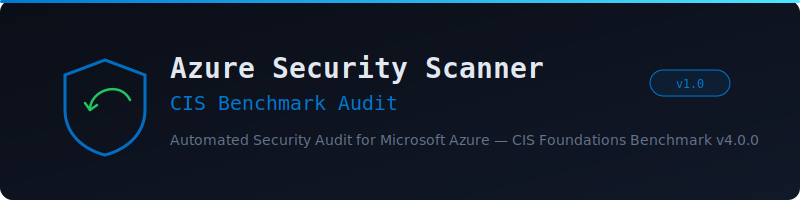

<p align="center">
  
</p>

<p align="center">
  <strong>Automated security audit scripts for Microsoft Azure environments, aligned to the CIS Azure Foundations Benchmark v4.0.0</strong>
</p>

<p align="center">
  
  
  
  
  
</p>

---

## Overview

Automated security audit scripts for Microsoft Azure cloud environments, aligned to the **CIS Microsoft Azure Foundations Benchmark v4.0.0**. Produces color-coded terminal output with PASS/FAIL/WARN verdicts and saves evidence files to a timestamped output directory.

- **70+ security checks** across 16 audit sections
- **CIS Benchmark aligned** — Azure Foundations Benchmark v4.0.0
- **Zero external dependencies** — Bash + Azure CLI + Python 3 only
- **Read-only by design** — never modifies Azure resources

---

## Repository Structure

```
Azure-Security-Scanner/
├── azure_security_audit_scripts.sh   # Base audit script (8 sections, ~35 checks, ~900 lines)
├── azure_security_audit_enhanced.sh  # Enhanced audit script (16 sections, 70+ checks, ~920 lines)
├── docs/
│   └── banner.svg
├── README.md
└── LICENSE                           # GPL-3.0
```

---

## Scripts at a Glance

| Script | Sections | Checks | Lines | Scope |
|--------|----------|--------|-------|-------|
| `azure_security_audit_scripts.sh` | 8 | ~35 | ~900 | IAM, Storage, Networking, Logging, Key Vault, VMs, App Service, Database |
| `azure_security_audit_enhanced.sh` | 16 | 70+ | ~920 | Everything above + Defender for Cloud, Conditional Access, Resource Locks, NSG Flow Logs, Bastion, ACR, AKS, Miscellaneous |

Sections 1–8 are identical across both scripts. Use the enhanced script for comprehensive audits.

---

## Prerequisites

- **Azure CLI 2.50+** — installed and authenticated (`az login`)
- **Python 3.8+** — for inline `python3` heredoc checks
- **IAM permissions** — the executing identity needs the `Reader` role on the target subscription and `Global Reader` (or equivalent) on the Entra ID tenant
- **Microsoft Graph API access** — Sections 1 and 10 query Entra ID via `az rest` calls to the Graph API
- **Default subscription** — the currently active subscription is used; override with `--subscription <id>`

---

## Usage

```bash
# Run the base audit (Sections 1–8)
bash azure_security_audit_scripts.sh

# Run the enhanced audit (Sections 1–16)
bash azure_security_audit_enhanced.sh

# Target a specific subscription
bash azure_security_audit_enhanced.sh --subscription <subscription-id>
```

Output is written to `azure_audit_<SUB_ID>_<YYYYMMDD_HHMMSS>/` in the current working directory. The directory contains evidence CSV/JSON files for each check and a final `AUDIT_MANIFEST.txt`.

---

## Security Checks Coverage

### Sections 1–8 (both scripts)

| Section | Check IDs | Description |
|---------|-----------|-------------|
| **1: Identity & Access Management** | IAM-01 to IAM-08 | Security Defaults, Global Admin count, guest access restrictions, user consent for apps, app registration, custom subscription admin roles, tenant creation, guest invite restrictions |
| **2: Storage Accounts** | STG-01 to STG-06 | HTTPS-only transfer, network access rules (default deny), minimum TLS 1.2, public blob access disabled, infrastructure encryption, shared key access disabled |
| **3: Networking** | NET-01 to NET-05 | NSG risky port checks (RDP 3389, SSH 22, DNS 53, HTTP 80) open to `0.0.0.0/0`, Network Watcher enabled per region |
| **4: Logging & Monitoring** | LOG-01 to LOG-04 | Diagnostic Settings for Activity Logs, Activity Log Alerts (10 critical operations), Key Vault diagnostic logging, resource-level logging |
| **5: Key Vault** | KV-01 to KV-04 | Soft delete enabled, purge protection, RBAC authorization, network access restrictions |
| **6: Compute / VMs** | VM-01 to VM-03 | Disk encryption (OS + data), public IP on VMs, managed identity, installed extensions audit |
| **7: App Service** | APP-01 to APP-05 | HTTPS-only, minimum TLS version, managed identity, FTP state (disabled/FTPS), HTTP logging |
| **8: Database Services** | DB-01 to DB-09 | SQL auditing + TDE + public access + Entra admin, PostgreSQL Flexible Server (SSL + public access), MySQL Flexible Server (SSL + public access), Cosmos DB (public access + network rules) |

### Sections 9–16 (enhanced script only)

| Section | Check IDs | Description |
|---------|-----------|-------------|
| **9: Microsoft Defender for Cloud** | DEF-01 to DEF-10 | Pricing tier checks for Servers, SQL Servers, SQL on Machines, App Services, Storage, Key Vault, Resource Manager, Open-Source Relational DB, Containers, Cosmos DB |
| **10: Conditional Access** | CA-01 to CA-04 | MFA for all users, MFA for risky sign-ins, MFA for admin portals, trusted locations configured |
| **11: Resource Locks** | LOCK-01 | Delete/ReadOnly locks on critical resources (CIS 7.2) |
| **12: NSG Flow Logs** | FLOW-01 | Flow Log retention >= 90 days, Traffic Analytics enabled (CIS 8.5 / 8.8) |
| **13: Azure Bastion** | BASTION-01 | Bastion Host deployed in VNets (CIS 9.4.1) |
| **14: Container Registry** | ACR-01 to ACR-03 | Admin user disabled, public network access, SKU (Premium for advanced features) |
| **15: Azure Kubernetes Service** | AKS-01 to AKS-04 | Azure RBAC, network policy, private cluster, managed identity, Defender for Containers |
| **16: Miscellaneous** | MISC-01 to MISC-04 | Unattached disk encryption, orphaned public IPs, Application Insights, Defender External Attack Surface Management |

---

## Script Architecture

Both scripts use the same internal structure:

1. **Shell setup** — `set -euo pipefail`, subscription/tenant resolution, timestamped output directory creation
2. **Helper functions** — `log()`, `pass()`, `fail()`, `warn()` with ANSI color output and automatic counters
3. **Sectioned checks** — labeled blocks (`SECTION N: SERVICE NAME`) with a consistent header format
4. **Hybrid Bash + Python** — simple checks use Azure CLI directly; complex multi-resource checks use inline Python heredocs (`python3 - <<'PYEOF'`) with `subprocess` and `json`
5. **Summary** — final PASS/FAIL/WARN tallies and evidence directory manifest

### Output Colors

| Color | Meaning |
|-------|---------|
| `[PASS]` (green) | Check passed — no issue found |
| `[FAIL]` (red) | Check failed — misconfiguration or missing control |
| `[WARN]` (yellow) | Check raised a warning — review recommended |
| `[INFO]` (blue) | Informational output — no verdict |

### Check ID Convention

| Prefix | Service Domain |
|--------|---------------|
| `IAM-XX` | Identity & Access Management (Entra ID) |
| `STG-XX` | Storage Accounts |
| `NET-XX` | Networking / NSGs |
| `LOG-XX` | Logging & Monitoring |
| `KV-XX` | Key Vault |
| `VM-XX` | Virtual Machines / Compute |
| `APP-XX` | App Service / Web Apps |
| `DB-XX` | Database Services (SQL, PostgreSQL, MySQL, Cosmos DB) |
| `DEF-XX` | Microsoft Defender for Cloud |
| `CA-XX` | Conditional Access Policies |
| `LOCK-XX` | Resource Locks |
| `FLOW-XX` | NSG Flow Logs |
| `BASTION-XX` | Azure Bastion |
| `ACR-XX` | Azure Container Registry |
| `AKS-XX` | Azure Kubernetes Service |
| `MISC-XX` | Miscellaneous Hardening |

---

## CIS Benchmark Mapping

| CIS Section | Scanner Section | Key Controls |
|-------------|-----------------|--------------|
| CIS 2.x | Sections 2, 5 | Storage Accounts, Key Vault |
| CIS 4.x | Sections 6, 8 | Virtual Machines, Database Services |
| CIS 6.x | Sections 1, 10 | Identity & Access Management, Conditional Access |
| CIS 7.x | Sections 4, 11 | Logging & Monitoring, Resource Locks |
| CIS 8.x | Sections 3, 12 | Networking, NSG Flow Logs |
| CIS 9.x | Sections 9, 13 | Defender for Cloud, Azure Bastion |

---

## Adding New Checks

1. Add a new numbered section block at the end of the script (before the summary block):

```bash
# ─────────────────────────────────────────────────────────────────────────────
# SECTION N: SERVICE NAME
# ─────────────────────────────────────────────────────────────────────────────
echo -e "\n${BLUE}══ SERVICE NAME CHECKS ══${NC}"

log "SVC-01: Description of check"
RESULT=$(az service command --query "expression" -o tsv 2>/dev/null)
if [ "$RESULT" == "expected" ]; then
    pass "SVC-01: Description — compliant"
else
    fail "SVC-01: Description — non-compliant"
fi
```

2. Define a new check ID prefix (e.g., `APIM-XX` for API Management) and add it to the table above.
3. Update the evidence manifest block in `AUDIT_MANIFEST.txt` generation at the bottom of the enhanced script.
4. If the check applies to base scope (Sections 1–8), apply it to both scripts; otherwise add only to the enhanced script.

### Important Conventions

- **Read-only by design** — all API calls must be read-only operations (`az ... show`, `az ... list`, `az rest --method GET`). Never modify Azure resources.
- **No credentials in code** — scripts rely on the ambient `az login` session. Never hardcode secrets or tokens.
- **Python blocks print ANSI output directly** but do NOT increment the shell `PASS`/`FAIL`/`WARN` counters (known limitation — counters reflect only checks run natively in Bash).
- **Sections 1–8 are shared** across both scripts. Changes to shared sections must be applied to both files.
- **Evidence files** (CSV, JSON) are written to `OUTPUT_DIR`. The manifest at the end of each run catalogs them.
- **Broad exception handling is intentional** — a single check failure must never crash the entire audit run.

---

## Testing

No automated test suite is included. To validate changes:

```bash
# Syntax check without executing
bash -n azure_security_audit_enhanced.sh

# Full run against a test Azure subscription
bash azure_security_audit_enhanced.sh

# Target a specific subscription
bash azure_security_audit_enhanced.sh --subscription <subscription-id>

# Verify output directory is created and populated
ls azure_audit_*/
```

Run against a subscription with `Reader` permissions and confirm PASS/FAIL/WARN verdicts match known resource states.

---

## Git Workflow

- The `main` branch is the primary branch
- Commit messages describe the change directly (no conventional commits prefix required)
- No CI/CD pipelines, pre-commit hooks, or automated releases
